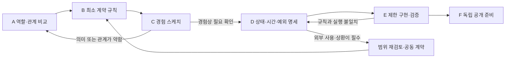

# THE RESERVE — 현재 설계 감사와 세계관 설계 범위·로드맵

검토 기준일: 2026-09-06 (Asia/Seoul). 관련 저장소의 동시 작업은 22:39 KST 변경분까지 반영했다. 조사·분석·계획 산출물. 이 문서의 권장안은 사용자 확정 설정이 아니다. 저장소 밖에 작성했으며 원문, Wiki, 로그, 상태값, 이슈, 구현, 커밋과 푸시를 변경하지 않았다.

## 1. 핵심 결론

**THE RESERVE는 공개 정체성을 선택하고 기관의 작동 방식을 비교하는 단계다.** 이름 **THE RESERVE**, bio **“A place for what remains.”**, 같은 세계관 안에서도 다른 작품의 공개 문구를 반복하지 않는다는 요구는 사용자 결정이다. 관객에게 무엇을 허용하는 기관인지, 무엇을 취급하는지, 어떤 권리와 의무가 생기는지는 아직 선택되지 않았다. 다섯 기관 후보와 미래 청구권 모델은 비교할 수 있을 만큼 서술되어 있지만, 승인된 운영 명세나 구현 증거는 없다. [R1][R2][R3][R4]

**이번 로드맵의 권장 범위는 ‘기관 중심’이다.** 관객 한 명의 핵심 행위가 기관의 규칙을 거쳐 결과로 끝나는 범위까지 설계한다. 기관 정체와 대상은 D2, 실제 결과를 바꾸는 계약·시간·상태 전이는 D3, 다른 작품과의 관계는 D1을 기본으로 삼는다. 거시경제와 공통 통화는 현재 핵심 경험에 필요한 의존성이 입증되지 않아 보류한다. 이는 설정을 작게 만들자는 원칙이 아니라, 지금 해결해야 할 문제가 ‘경제의 기원’보다 ‘이 기관이 실제로 가능하게 만드는 행위’이기 때문이다.

기관 유형의 **검증용 작업 가정**으로는 기존 후보 중 **미래의 구체적 이행 약속에 대해 현재 사용할 권리를 제공하고, 그 관계를 만기까지 관리하는 방향**을 우선한다. 아래에서는 이를 미래 청구권 후보라고 부른다. 기존 LLM이 추천했다는 이유로 채택하는 것이 아니다. 현재의 이용 가능성과 미래 의무를 연결하면 은행 형식의 필요를 실제 행위로 시험할 수 있고, 다른 작품의 상업·리서치 역할과 비교할 기준이 생긴다. 다만 **‘지금 무엇을 사용할 수 있는가’가 미해결**이므로 이 후보가 작품으로 성립했다고 판정하지 않는다.

**가장 먼저 할 일은 기관 역할 선택을 위한 비교 검증이다.** 현재 이익, 미래 의무, 기관이 부담하는 약속, 종료 조건을 한 사례로 연결한다. 숫자나 화면 이동 외에 관객의 선택·통제권·가능 행동에 변화가 없다면 신용 후보를 통과시키지 않는다. 의미 있는 접근권은 현재 이익의 후보가 될 수 있다. 통제권의 위탁과 반환이 더 중요한 경험이라면 기존 보관 후보로 돌아가 동일한 검증을 한다. bio는 어느 후보도 결정하지 않는다.

현재 설명할 수 있는 것은 ‘어떤 이름과 어조로 존재하는가’, ‘어떤 기관 모델을 비교해 왔는가’, ‘왜 그 제안을 승인으로 취급하면 안 되는가’다. 아직 결정할 수 없는 것은 실제 계약 내용, 관객의 이익과 손실, 수량의 의미, 시간 처리, 필요한 구현 범위다. 진척도를 백분율로 표시할 근거는 없다.

## 2. 조사 범위와 근거

### 2.1 조회한 판본과 구현 조사 범위

각 로컬 저장소의 지침과 index → current-state → schema → 관련 개념·결정·질문을 먼저 읽었다. 이후 중요한 판단을 원문·등록부·변경 이력과 대조했다. GitHub 조회는 읽기 전용이었다.

| 저장소 | 조사한 브랜치·커밋 | 최신성·작업 트리와 한계 |
| --- | --- | --- |
| THE RESERVE | `main`, `e2aa812754892db5f3399f3d53aa7041d2faff96` | 로컬과 조회한 원격 main 일치. 작업 시작 시 clean. 전체 추적 파일 목록과 루트 확인에서 문서·관리 파일 외 코드, 실행 프로토타입, 테스트가 발견되지 않음. |
| LONGING | `main`, `2db561c0169a7592bdf4c88041ebdcf824296236` | 로컬 HEAD와 원격 main 일치. 기존 미커밋 로드맵 외에 조사 중 세계 규칙·LETTER 명세·단위 비교 초안이 추가됨. 22:39 KST 로컬 변경분을 별도 검토했으며 LLM 제안을 사용자 승인이나 커밋된 정본으로 사용하지 않음. |
| OTHER GOODS | `main`, `35dd6452c7c496f65607afc4222aac41a01b8d81` | 로컬과 원격 main 일치, clean. 9월 6일 등록된 raw가 9월 5일 Wiki보다 새로워 해당 원문을 직접 확인. |
| TENDER SYSTEMS | 로컬 `main`, `430cb65d8a4a6e63b91ca011d7a8e492034028a3` | 실제 발견한 `D:/TENDER SYSTEMS/tender-systems`. origin은 같은 조직의 `tender-systems.git`. 원격 branch 조회는 404여서 원격의 존재·접근 조건·최신성은 확정하지 않음. 시작 시 clean, 조사 중 창작 동기 원문과 등록부의 미커밋 변경 발생. |
| 조직 `.github` | 원격 `main`, `7996de84e4bb0d19d2a1ced00815a4971ac3e060` | `profile/README.md` 확인. 기관 한 줄 소개와 OG-001·LN-001 링크만 있음. 금융 인프라 명세가 아님. [G1] |

원격 GitHub 검색에서 네 저장소가 반환되었고, 별도로 로컬 기관 저장소를 발견했다. 검색 결과만으로 기관 저장소의 부재를 단정하지 않았다. 일반 웹 조회는 캐시 오류가 났지만 GitHub 연결 도구로 위 네 원격 저장소를 확인했다. 다른 브랜치, 외부 배포, 개인 문서, 누락 대화까지 전수 조사한 것은 아니다. ‘이 조사 범위에서 구현·결정을 찾지 못함’과 ‘어디에도 없거나 논의된 적 없음’은 다르다.

### 2.2 핵심 근거 지도

표의 근거 코드는 아래 문서와 해당 섹션을 가리킨다. 링크는 가능한 경우 조사한 커밋에 고정했다. 한국어 보고서에서는 현재 요청에 맞춰 LONGING RESEARCH라고 부르되, 실제 저장소·문서명과 원문 표기 LONGING을 보존한다.

| 코드 | 실제 문서·섹션 및 출처 | 이 보고서에서의 용도 |
| --- | --- | --- |
| R1 | THE RESERVE [current-state][R1], `Confirmed / Under review / Evidence limits`; [overview][R7] | 현재 상태와 증거 한계. |
| R2 | [DEC-001-project-name][R2], `Decision / Rationale and limits`; [DEC-002-public-language][R3], `Decision / Evolution / Limits` | 이름·bio·독립 문구의 확정과 해석의 한계. |
| R3-원문 | [project-naming-and-public-language][RN], `SRC-2026-09-06-project-naming-and-public-language`; 사용자 01:49:24, 13:45:27, 13:46:22, 19:57:32 발언 | 이름 선택, 두 bio 대안 거절, 최종 bio 승인 직접 검증. |
| R4 | [institutional-directions][R4]; [future-claims][R5]; [Q-001-institutional-scope][R6] | 다섯 미선택 후보, 제안된 흐름, 열린 결정. |
| R5-원문 | [bank-artwork-interpretation][RB], `SRC-2026-09-06-bank-artwork-interpretation`; `Prompt`, `Five Distinct Conceptual Directions`, `Strongest Direction`, `Shared Monetary Unit`, `Further Questions` | 실질 내용이 assistant 발언임을 확인. 수치·통화·상품·시간의 제안 상태 검증. |
| R6-기록 | [raw/sources.md][RS], [wiki/log.md][RL], 초기 커밋 `35e2c23a2a00493f27857ae613500006176cb528`의 current-state | 해시·누락 첨부·두 차례의 기록 상태 변화 검증. |
| L1 | LONGING [DEC-002-research-house-form][L1], `Decision / Status`; [current-state][LC] | 리서치 하우스와 거래 앱의 차이. 잠정 수용임을 보존. |
| L2 | LONGING 커밋판 [Q-004-unit-of-account][L2], [arbitrage][L3], [pricing-model][L4]; 22:39 로컬 [world-rules][L5] §4–6와 [Q-004 변경판][L6] `Evolution — three executable meanings to compare` | 커밋판의 열린 질문과, 이후 U1/U2/U3 단위·상대방·정산 비교 제안을 구분. 새 작업 지시 출처는 `SRC-2026-09-06-world-rules-letter-spec-request`. [L7] |
| O1 | OTHER GOODS [commerce-as-medium][O1], [DEC-002-perfect-store-principle][O2], [Q-008-product-or-transaction][O3], [time-as-currency][O4] | 정상 상업 시스템, 거래의 역할, 기존 TIME 보류. |
| O2-최신원문 | [2026-09-06-post-v0.5-pre-v0.6-working-decisions.md][O5], `SRC-2026-09-06-post-v0.5-pre-v0.6-working-decisions`, §2–5·§14 | Wiki 이후의 공동 논의 요약. 상품 진입점·거래 활성화·USD 상거래 시뮬레이션의 작업 가정. |
| T1 | 기관 [DEC-002-decision-placement][T1], [DEC-001-repository-conventions][T2] | 작품 내부 정본과 작품 간 공동 결정의 경계. 해당 페이지는 confirmed지만 독립 raw가 없는 `sources: []` 한계도 있음. |
| T2 | 기관 [DEC-004-institutional-voice][T3], [DEC-005-public-facing-language][T4] | 조직적 외관·기존 작품에서 정체성 도출·운영을 말하는 공개 언어. `SRC-2026-09-04-tender-systems-identity-review`, `SRC-2026-09-05-social-account-strategy`로 연결. |
| T3 | 기관 [tender-subject-systematic-form][T5], [tender-duality][T6], [public-surfaces][T7], [registry][T8] | 공통 문법은 옛 기록상 가설. tender 언어·운영용 소셜 계정·기관 등록부는 공통 화폐나 관객 금융 계좌의 승인 근거가 아님. |
| G1 | 조직 [.github/profile/README.md][G1] | 조회 당시 공개 소개의 실제 범위. |

### 2.3 증거 충돌과 조사 한계

- **누락된 원래 프롬프트:** 은행 해석 원문의 사용자 발언은 첨부 프롬프트에 한국어로 답하라는 요청이고, `붙여넣은 마크다운(1).md`의 본문은 등록 자료에 없다. 이번 감사 프롬프트를 그 과거 첨부와 동일한 문서라고 취급하지 않았다. 그 응답의 세부 내용을 사용자 요구사항으로 복원할 수 없다. [RB][RS]
- **승인과 해석:** 이름과 bio는 한 대화의 명시적 승인으로 확인된다. 단일 출처라는 한계는 있으나 승인을 추정한 것은 아니다. 이후 assistant가 덧붙인 보관·축적 해석은 별도 승인되지 않았다. bio 반영도 사용자 보고이며 외부 계정의 실시간 확인 결과는 아니다. [RN]
- **기록의 진화:** 초기 Wiki의 ‘개념 미기록’과 현 Wiki의 ‘기관 후보 존재’는 충돌한 설계 결정이 아니라 자료 추가의 결과다. 과거 은행 해석 → 이후 이름·bio 결정의 시간 순서는 확인되지만, 뒤의 bio가 앞의 신용 후보를 채택하거나 폐기했다는 발언은 없다. [RL][RN][RB]
- **OTHER GOODS의 Wiki 지연:** 9월 5일 Q-008은 상품·거래 및 돈의 역할을 미정으로 둔다. 9월 6일 원문 요약 §14는 USD 시뮬레이션을 작업 가정으로 둔다. 후자는 `working / jointly-developed` 요약이며 발언별 전사·명시적 승인 문장이 없다. 따라서 ‘논의된 최신 작업 방향’과 ‘확정 결정’을 분리하고, 기존 Wiki만으로 최신 상태를 단정하지 않았다. [O3][O5]
- **LONGING의 잠정 수용:** current-state의 Confirmed 목록보다 DEC-002와 원문의 ‘일단은 그렇게 가보자’라는 승인의 범위를 우선했다. 리서치 하우스는 잠정 수용 방향이다. 차익거래 검토 요청은 거래 앱이나 공통 정산망의 승인과 다르다. [L1][L3]
- **조사 중 발전한 LONGING 초안:** 사용자가 세계 규칙과 LETTER 실천 명세의 작성 및 일관성 목표를 요청했다. 새 `world-rules.md`와 변경된 Q-004는 단위·보유·상대방·정산을 구체적 대안으로 비교하지만 `llm-proposed`이며 어느 안도 채택되지 않았다. 따라서 ‘단위에 대한 구체안이 없다’고 쓰지 않고 ‘구체안은 있으나 선택된 운영 계약은 없다’고 판정한다. 22:39 스냅샷 Git blob은 world-rules `aeee9cb6dd841b257ee2e57affee9dbeca2f1d19`, Q-004 `c98f55fea5e593a8f727e5f94e4bb7a584da3494`, current-state `60ec8b5570617a26e001edf07539d3efd07dd7f2`다. 이 미커밋 링크는 이후 작업으로 달라질 수 있다. [L5][L6][L7]
- **기관 공통 문법:** 옛 기관 페이지에서 가설인 문법을 이번 사용자 프롬프트 §1.1이 분석 맥락으로 제공했다. 이번 검토의 전제로 사용할 수 있지만 과거 상태값을 소급 확정하거나 공통 통화의 승인으로 확대하지 않는다. [T5]
- **기관의 새 배경 자료:** 조사 중 `SRC-2026-09-06-creative-origin-and-motivation`이 추가되었다. 사용자는 창작의 동기를 보존하되 작품 철학으로 승격하지 말라고 명시했다. 은행 역할·통화 선택에 영향이 없어 배경 원문으로만 취급했다. 등록부에 승격 언급이 있어도 조회 당시 Wiki 반영 완료를 독립적으로 확인한 것은 아니다. [T9]
- **원본 검증:** THE RESERVE 3건, OTHER GOODS 29건, 기관 4건의 시작 해시는 등록값과 일치했다. LONGING 42건 중 일반 `git hash-object` 기준 1건의 차이가 있었다. 대상은 `raw/documents/2026-09-06-cross-domain-model-survey-korean.csv`이며 등록값 `cb969b28567cc6c01c94e71629d2563459b5a3c8`, 일반 명령 결과 `ccb350ed9eb8377147a755ab2d5f7ad7e2795062`다. `--no-filters`와 HEAD blob은 등록값과 같아 정규화 경로 차이로 좁혀졌다. 훼손으로 단정하지 않으며 이 CSV의 내용을 결론의 근거로 쓰지 않는다. 이 항목은 검증 절차의 **REVIEW_REQUIRED 신호**로 보고서에만 남긴다. 사용자 요청에 따라 저장소 상태·등록 해시를 수정하지 않았다.

종료 검증에서 THE RESERVE **3/3**, OTHER GOODS **29/29**, 새 자료를 포함한 기관 **5/5**가 일치했다. LONGING은 새 원문을 포함해 **43개 중 42개가 일반 해시와 일치**했고 기존 파생 CSV의 정규화 차이만 남았다. THE RESERVE와 OTHER GOODS 작업 트리는 끝에도 clean이었다. LONGING과 기관의 추가 변경은 동시에 진행된 다른 작업에서 발견한 것으로, 이 감사가 작성한 파일은 저장소 밖 보고서뿐이다.

보고서의 금융 용어는 기존 후보의 검토와 작품 안에서 선택할 규칙을 설명하기 위한 것이다. 기존 LLM의 현실 은행 설명·가상 확률을 검증된 금융 사실로 재인용하지 않았다. 현실 금융 일반론에 의존해 기관 유형을 결정하지 않았으므로 이번 조사에 불필요한 금융사·규제 조사를 추가하지 않았다.

## 3. 현재 설계 감사

‘설계 구체성’은 기록이 얼마나 작동을 설명하는지, ‘결정 상태’는 누가 무엇을 승인했는지, ‘구현 증거’는 실제 실행물이 확인되는지다. 셋을 합산하지 않는다. 아래 구현 없음은 조사한 THE RESERVE 커밋과 로컬 파일 범위의 판단이다.

| 영역 | 현재 기록된 내용 | 결정 상태·발언 주체 | 설계 구체성 | 구현 증거 | 남은 공백 | 근거 |
| --- | --- | --- | --- | --- | --- | --- |
| 작품의 핵심 | 공유 세계관·독립 공개 언어. 미래 약속, 신뢰, 통제권, 의무 종결, 보증이라는 후보 질문 | 독립 문구는 사용자 확정. 이번 프롬프트의 공통 맥락은 현재 작업 전제. 은행의 중심 질문은 LLM 후보 | 제목 수준의 정체성은 명확. 관객이 경험할 핵심 대비는 후보 D1 | 문서 외 실행 증거 없음 | 무엇 때문에 별도 작품이어야 하는지, 어떤 행위와 결과가 그 질문을 드러내는지 | R1·R2·R4·T3 |
| 기관의 정체 | 다섯 유형. 미래 청구권 후보는 심사·현재 신용·만기 관리 제안 | 모두 `llm-proposed`. 사용자 선택 없음 | 역할 후보 D1, 미래 청구권은 부분 D2 서술 | 없음 | 누구를 위해 누구에게 어떤 권한을 행사하는가. 기관도 무엇을 약속하는가 | R4·R5·R6 |
| 취급 대상 | 미래 행동·상태에 관한 claim, 보관 후보의 접근권 등 | LLM 제안 | 대상 계열 D1. 증빙·claim·권리의 구별 불완전 | 없음 | 무엇이 적격인가. 신청 진술과 승인 후 생긴 권리·의무는 어떻게 다른가 | R5·R6·RB |
| 제도와 규칙 | 만기, 신용 한도, 담보, 할인, 이자, 심사 요소·상품 세 가지 예시 | 승인되지 않은 LLM 예시 | 정상 흐름 일부 D2. 수치 예시가 있어도 일관된 계산·규칙 D3 아님 | 산식·검증 가능한 모델 없음 | 자격, 권리 주체, 계약 성립, 거절 이유, 조건 변경, 적용할 수수료 여부 | R5·RB |
| 결과와 위험 | Performing·Defaulted 등 상태; 계약상 이행과 개인적 의미의 불일치 | LLM 제안. 이번 요청은 실제 입출금·신용·민감정보를 범위에서 제외 | 긴장 D1, 상태 이름 일부 D2 | 상태 전이 실행 증거 없음 | 승인으로 얻는 실질적인 작품 내 이익, 미이행 결과, 종료·회복의 의미 | R5·R6 |
| 통화와 수량 | 잔액·현재가치·한도·할인율 예시. 반복 단위와 TENDER/TDR 아이디어 | LLM 제안, 공통 통화 승인 없음 | 표기 예시 D1. 무엇을 세는 수량인지 미정 | 원장·발행·정산 없음 | 가격·수량·계정 기록·청구권·지급 수단의 구분 | R5·RB·L2·O4 |
| 관객 경험 | 신청→평가→조건→시간 경과→계정 변화 제안 | LLM 제안 | 중간 흐름은 부분 D2. 진입·수락·퇴장·복귀·종료 연결 미완성 | 화면·프로토타입·참여 검증 자료 없음 | 관객의 필요와 선택 이유, 거절·취소·재방문 경험 | R5·R6 |
| 공통 세계관 | 조직적 표현과 운영 언어. OTHER GOODS·LONGING과 연결을 제안 | 공통 공개 원칙은 근거 있는 사용자 결정. 개별 금융 역할·연결은 미정 | 기관 관계 D1. 공통 운영 계약은 없음 | 공통 계정·정산망 증거 없음 | 공유의 필요성, 독립 공개 조건, 공통 정본에 올릴 약속의 범위 | T1–T3·G1·L2·O5 |
| 공개 표현 | THE RESERVE, 정확한 bio, 타 작품 문구 재사용 금지. RS-001·핸들 후보 | 이름·bio·금지 문구는 사용자 확정. 코드·핸들·추가 어휘는 LLM 제안 | 확정 문구는 적용 가능. 업무·화면 언어는 아직 역할 미정 | README 적용 확인. 외부 프로필은 사용자 보고만 | 계약·판정 문구, 접점별 공개 수준, 실제 권리 오해 방지 | R2·R3·RN·T4 |
| 구현과 운영 | Wiki 저장소, 등록부와 출처 체계 | 저장소 운영은 수행됨. 작품 서비스 구현과 별개 | 작품 운영은 미정 | 추적 파일 18개는 Markdown·관리 파일. 코드·테스트·앱 manifest 없음 | 매체, 저장 방식, 시계, 중복 처리, 복구, 운영 종료와 관리 책임 | R7·RS·RL·파일 목록 |

**다음 단계에 사용할 수 있는 것:** 확정 공개 문구, 대안을 비교할 재료, 출처 구분, 미해결 질문 목록이다. **구현 명세로 사용할 수 없는 것:** 예시 금액·등급·상품·만기·담보·공통 통화와 실시간 동작이다. 채택된 상호작용이 없는 상태에서 이들을 기능 목록으로 옮기면 LLM 제안을 사실상 고정하게 된다.

## 4. 세계관 설계 범위 권장안

### 4.1 범위 대안 비교

| 대안 | 작품적 이득 | 추가 결정 | 의존성 | 유지관리 부담 | 중복 위험·선택 판단 |
| --- | --- | --- | --- | --- | --- |
| **기관 중심 — 권장** | 관객과 기관 사이의 권한·의무·시간을 밀도 있게 경험. 독립 공개 가능성을 직접 검증 | 핵심 행위 하나, 대상·계약·결과·종료, 최소 외부 전제 | 타 작품의 실제 거래·통화가 없어도 검증 가능 | 선택한 계약과 핵심 경로에 집중. 시간·저장이 필요하면 그 부분은 정교해야 함 | 단순 신청·상태 화면은 다른 작품과 겹침. ‘기관이 만들어 내는 관계’로 분리해야 함 |
| 공통 인프라 포함 | 공통 참조가 일관된 세계를 드러냄. 실제 이전까지 선택하면 다른 작품에서 같은 권리를 사용·상환하는 경험 가능 | 참조·단위만 공유하면 의미·정본·버전. 실제 이동을 택하면 수용 주체·원장 책임·취소·정산. 계정 통합은 별도 선택 | 참조의 의미에 대한 합의. 실제 거래 연결에는 거래 대상·단위·수용에 대한 공동 결정 추가 | 참조 공유는 정의·버전 관리. 이전·정산에는 여러 시스템의 장애 대응, 계정 통합에는 복구 부담 추가 | 가벼운 참조 공유는 기관 중심 범위와 양립. 실제 연결이 핵심이면 이 대안이 적합하나 현재 필요·승인은 미확정 |
| 경제·사회 체계 포함 | 발행 권한·보증·분배·제도 정당성을 작품의 주제로 삼을 때 이득 | 다수 기관, 부채·보증 관계, 권한·관할, 위기와 역사 중 실제 결과에 필요한 것 | 여러 주체와 전체 계통의 일관된 역할 | 모든 새 약속이 다른 규칙의 결과를 바꿈. 검증 범위 큼 | 현재 기관 행위 공백을 해결하지 않고 배경만 증가할 위험. 발행·최종 보증을 핵심으로 선택할 경우에는 적합할 수 있음 |

기관 중심을 선택해도 ‘외부는 설명하지 않으므로 내부 규칙도 없다’고 두지 않는다. 기관이 권리를 제공한다면 **누가 그것을 받아들이고 무엇을 이행해야 하는지**는 내부에서 정해야 한다. 외부 발행 역사나 국가 이름은 그 약속을 계산·판정하는 데 필요한 경우에만 들어온다.

### 4.2 기관 유형별 경계와 검증 순서

다섯 후보는 모두 기존 기록의 미선택 대안이다. 아래 우선순위와 판정은 이번 검토의 제안이다. [R4]

| 후보 | 은행 형식이 필요해질 조건 | 해당 유형을 고르면 필수인 설계 | 이번 판정 |
| --- | --- | --- | --- |
| 미래 청구권 | 아직 이행되지 않은 약속 때문에 현재 가능한 행위가 생기고, 상대 의무와 만기가 남음 | 현재 권리의 효용·수용 주체, 특정 claim 심사, 이행·미이행·종료. 금액이 필요하면 그 수량의 근거 | **첫 검증 후보.** 현재 이익의 내용이 없으므로 승인·구현 단계는 아님 |
| 보관·통제권 위탁 | 단순 저장을 넘어 접근 통제 위임과 기관의 반환 의무가 핵심 경험 | 원대상·접근권·보관 기록 구분, 위탁 중 권한, 반환 조건, 기관 실패 시 결과 | 가장 가까운 대안. bio 때문이 아니라 현재 이익보다 통제권 상실·반환이 더 강할 때 선택 |
| 신뢰 평가 | 판정이 실제 권한·보증·책임에 연결됨 | 심사 대상·증거 한계, 판정의 효과·이의 처리 | 평점만 나오면 은행 필요가 약하고 리서치·평가기관과 중복. 독립 효과 없이는 보류 |
| 의무 상계·종결 | 둘 이상의 의무를 서로 지울 수 있는지, 무엇이 남는지가 핵심 | 채권자·의무자, 비교·상계 가능 조건, 모두의 종결 승인과 불일치 | 통화 없이도 가능. 다수 관계가 관객에게 직접 이해될 때 재검토. 외부 작품 연결은 필수 아님 |
| 보증·최종 지원 | 타인의 실패를 기관이 실제로 떠안고 보증의 한계가 경험됨 | 보증 대상, 청구 자격, 기관의 이행 자원·한도, 보증자 실패 | 배경기관만 늘리면 약함. 보증을 핵심 질문으로 선택할 경우 이 범위를 먼저 넓혀야 함 |

### 4.3 목표 깊이·노출·구현

D0 = 이번에 설계하지 않음(불필요/보류 구분). D1 = 존재·역할·전제. D2 = 정상 흐름, 입력·결과, 권리·의무, 핵심 제약의 일관된 규칙. D3 = 상태·시간·필요 계산·예외·검증 사례. **깊이는 설정의 분량이나 승인 수준이 아니다.** 아래 목표는 권장 범위의 설계 완료 시점이며 지금 바로 코드로 구현하라는 뜻이 아니다.

| 영역 | 현재 깊이 | 목표 깊이 | 필요한 이유 | 관객 노출 범위 | 구현 필요성 | 여기서 멈추는 기준 |
| --- | --- | --- | --- | --- | --- | --- |
| 기관 정체 | 후보 D1, 선택 없음 | D2 | 누가 무엇을 신청하고 기관이 무엇을 보장하는지 결정 | 첫 행위에 필요한 업무 설명. 내부 목적·한계는 제작자용 | 역할 비교는 정적 스케치로 충분 | 현재 가능해지는 행위와 상대 의무를 한 사례로 설명 |
| 취급 대상 | 후보 D1 | D2, 결과를 바꾸는 입력 필드는 D3 명세 | 대상·진술·증빙·기록·생성 권리가 섞이면 판정 불가 | 제출 항목과 적격/부적격 이유 | 스케치 후 선택한 입력·판정만 실제 처리 | 허용 2종·거절 2종을 같은 정의로 구분. 분야 백과사전은 불필요 |
| 운영 규칙 | 부분 D2 제안 | 핵심 계약 D3, 주변 업무 D0 | 수락·거절·이행을 임의 결정하지 않기 위해 | 선택 전에 조건·결과, 처리 후 상태·이유. 내부 판정표는 발견 가능한 설명에 필요 부분만 | 한 계약을 끝까지 처리하는 좁은 구현 | 정상·거절·취소·만기 사례를 새 규칙 없이 처리 |
| 시간과 결과 | 상태 이름·실시간 제안 D1–부분 D2 | 핵심 경로 D3 | 시간 차이가 선택과 권리를 바꾸는지 확인 | 언제 무엇이 달라지는지와 현재 상태. 내부 시계·전이 순서는 비노출 가능 | 우선 모의 시계. 실제 경과를 채택하면 영속 저장·재개·복구 필요 | 종료 후 남는 것까지 추적. 이자는 시간 채택만으로 자동 추가하지 않음 |
| 통화·수량 | 예시 D1 | 기본 D1. 권리·수량 의미 D2. 실제 잔량을 쓰면 그 계산만 D3 | 수치가 관객의 가능 행동과 연결될 때만 필요 | 단위 의미·사용 가능 범위·소멸 조건 | 권한형 시험에는 화폐 엔진 불필요. 양적 사용을 택하면 일관된 기록 필요 | 각 숫자의 대상과 내부 권리의 생성·사용·종료를 설명. 통화 발행·준비자산은 별도 필요가 입증될 때 설계 |
| 관객 경험 | 중간 흐름 부분 D2 | 핵심 왕복 D3 | 진입부터 결과·퇴장·복귀까지 선택의 인과를 검증 | 조작과 그 결과는 필수 노출. 작품 해설은 필수 아님 | 앞부분은 종이/클릭 스케치. 유효성이 확인된 행동·결과는 실제 작동 | 관객이 ‘내 선택 때문에 무엇이 바뀌었는지’ 설명 |
| 다른 작품과의 연결 | 비교·반복 단위 제안 D1 | D1, 실제 공유 계약을 택할 때만 D2→D3 | 철학 공유와 운영 의존성을 분리 | 선택적 출처·기관 참조. 타 작품 선행 지식 없이 진입 | 링크·참조는 정적으로 가능. 공통 인증·정산은 이번 구현 대상 아님 | 한 작품의 가격·계정이 없어도 핵심 흐름 성립 |
| 외부 경제·역사 | 단편 LLM 제안 | D0 보류, 특정 권한 전제가 필요하면 D1 | 거시적 설정은 현재 행위의 원인이 아님 | 필수 노출 없음 | 구현 없음 | 정상·거절 사례를 설명하는 데 불필요한 기원을 추가하지 않음 |
| 공개 표현 | 이름·bio 확정, 기관 어조 D1 | 기존 정체성 유지 + D2 업무 문구 | 선택에 필요한 정확성과 독립 언어 | 업무·조건·결과는 공개. 내부 비교·해설을 같은 화면에 밀어 넣지 않음 | 정적 카피 + 실제 상태와 일치하는 메시지 | 모든 업무 명사가 실제 가능한 행위를 가리킴. RS-001은 미확정 유지 |
| 구현과 운영 | 작품 명세 없음 | 채택 경로만 D3 | 저장·시계·재입력·오류가 계약을 바꾸지 않도록 | 실패 시 상태·재시도·종료 안내. 구현 구조는 내부 | 선택한 매체와 시간 방식에 따라 결정 | 중복 처리·세션 이탈·기한 경계·복구에서 권리 상태가 일치 |

## 5. 설계 완료 기준과 보류 경계

### 5.1 다음 제작 단계로 넘어가는 기준

다음 여섯 조건을 모두 충족하면 핵심 경험의 제작에 필요한 세계관 설계는 완료된 것으로 본다. 이는 작품 전체의 완성 판정이 아니다. 가벼운 경험 스케치는 이 시점 이전에도 병행할 수 있다. 범위 밖 설정은 §5.2의 촉발 조건에 따라 재검토한다.

1. **기관의 필요가 설명된다.** ‘누가 무엇을 신청하고, 기관이 무엇을 가능하게 하며, 누구에게 어떤 의무가 남는가’를 한 사례로 설명한다. 은행식 제목·레이아웃을 지워도 그 관계가 남아야 한다.
2. **한 행동의 전 과정을 추적한다.** 입력, 판정 근거, 계약 수락, 권리·의무 생성, 시간 경과, 종료 후 남는 기록을 추적한다. 화면의 숫자·상태가 이 과정 밖에서 만들어지지 않는다.
3. **대표 상황을 즉석 설정 없이 처리한다.** 정상, 부적격, 만기, 취소·이탈, 미이행·정정의 적용 가능한 사례가 같은 규칙으로 끝난다. 새 상품이나 새 기관을 만들어 예외를 덮지 않는다.
4. **내부 확정과 비노출을 구분한다.** 관객에게 설명하지 않는 심사 기준도 제작자는 알고 있다. 반대로 미선택 시계·이익·상환 같은 사항을 ‘미스터리’라는 이름으로 숨기지 않는다.
5. **불필요한 작품 의존성이 없다.** 타 작품을 보지 않은 관객도 참여할 수 있다. 공유하는 참조가 있으면 정본·의미·버전을 정하고, 해당 작품이 응답하지 않아도 핵심 경험이 유지되는지 확인한다.
6. **핵심 선택에 사용자 판단과 검증 결과가 있다.** 선택한 기관 역할·대상·결과·노출 경계를 사용자에게 검토받는다. 스케치에서 관객이 자기 선택과 결과를 이해하고도 제도의 판단과 개인의 의미 사이의 긴장을 느끼는지 확인한다. 예상 반응을 실제 검증 결과로 기록하지 않는다.

추가 설정을 제안할 때는 ‘어느 대표 사례의 입력·판정·권리·결과가 이것 때문에 달라지는가’를 먼저 답한다. 답이 없더라도 역사나 주변 세계가 중심 예술적 질문일 수는 있다. 그 경우에는 단순 추가가 아니라 **범위 변경의 제안**으로 다시 비교해야 한다.

### 5.2 의도적 보류와 재검토 촉발 조건

아래는 기존 저장소의 상태를 바꾸는 표가 아니라 **이번 로드맵의 보류 제안**이다. 예외적으로 OTHER GOODS의 TIME은 기존에도 deferred다. [O4]

| 보류 영역 | 지금 남기는 이유 | 다시 설계할 구체적 조건 | 재개 시 필요한 깊이 |
| --- | --- | --- | --- |
| 공통 화폐·작품 간 잔액 이전 | 독립 상호작용에 지급 수단이 필요한지조차 미정 | THE RESERVE에서 생긴 단위를 OTHER GOODS가 받아 주거나 LONGING의 포지션을 실제 취득·청산하는 흐름을 선택 | 수용 주체·이전·소멸·실패·정산은 D3. 이름만 합의하고 사용하지 않음 |
| 발행·상환·준비자산·최종 보증 | 이번 가정은 작품 내부의 제한된 권리 검증 | 외부 주체에 대한 교환·상환 약속, 다수 청구의 경쟁, 보증자의 지급 한계가 실제 결과를 바꿈 | 자원·발행/회수·의무·부족 시 우선순위 D3 |
| 금리·담보·위험등급 | 현재 이익·의무가 정의되지 않아 수식의 피설명 대상이 없음 | 두 신청을 다르게 승인해야 하고 그 차이가 특정 증거·시간·이행 조건에서 발생 | 필요한 판정·계산만 D3. 관객 전체 점수로 확장하지 않음 |
| 복수 상품·재대출·구조조정 | 하나의 계약도 아직 끝까지 설명되지 않음 | 같은 정상 규칙으로 처리할 수 없는, 작품적으로 필요한 반복 사례가 확인 | 그 사례를 위한 별도 조건과 기존 계약 간 전환 D2→D3 |
| 실시간·장기 계정 | 실제 경과가 모의 시간보다 강한 경험을 주는지 미검증 | 기다림·재방문 자체가 작품의 핵심이며 사용자도 장기 운영을 선택 | 서버 시계, 저장, 장기 미접속, 복구, 서비스 종료 D3 |
| 다자 상계·외부 기관 | 첫 가정은 관객과 기관의 관계 | 의무의 이전·상계 또는 타인의 실패 보증을 기관의 중심 행위로 선택 | 각 당사자와 종결·불일치 규칙 D3. 이때 범위 권장안을 재평가 |
| 외부 경제·법적 권한·역사 | 기관의 한 사례를 처리하는 데 현재 필요 없음 | 관객이 권한의 정당성을 따지거나 역사적 사건이 적격·반환·분배를 바꿈 | 작동에 필요한 전제 D1부터. 거시 흐름을 조작한다면 해당 관계 D2/D3 |
| 공동 출시·공통 계정·공통 디자인 체계 | 기관적 어조 공유가 곧 동시 출시·동일 인증은 아님 | 둘 이상의 작품이 같은 인증·잔액·상태를 실제 요구하거나 연결 경험을 공개 목표로 선택 | 공통 약속과 소유·장애·버전 책임 D2/D3 |

실제 입출금, 외부 결제, 현실 신용 제공, 민감한 개인 서사·증빙 수집은 이번 범위의 빈칸이 아니다. 명시적 요구가 없는 한 추가하지 않는 범위 밖 항목이다. 이를 도입하려면 가상 규칙의 확장이 아니라 과업 범위 자체를 다시 정해야 한다.

## 6. 핵심 검증 결과

### 6.1 은행 형식은 아직 입증되지 않았다

현재 자료는 은행을 소재로 탐색했다는 점은 보여 주지만, 예금은행·중앙은행·발행기관 중 하나라는 결론은 지지하지 않는다. 후보의 적합성을 판단하는 **이번 검토의 기준**은 다음과 같다.

- 상점에서의 상품·주문 관계, 리서치에서의 평가·의견 기록에 더해 **이 기관이 특별히 책임지는 관계**가 있는가.
- 관객에게 생긴 권리는 누구에게 행사할 수 있고, 기관은 무엇을 이행해야 하는가.
- 시간과 미이행이 단순 애니메이션·벌점이 아니라 그 관계를 바꾸는가.
- 기관의 판정 절차는 일관되지만, 절차가 인정하는 이행과 관객이 느끼는 성취가 어긋날 수 있는가.

마지막 긴장은 기존 미래 청구권 제안의 유용한 부분이다. 제도를 고의로 오작동시키거나 인간적인 대상을 임의의 확률로 평가할 필요가 없다. **관찰할 수 있는 약속의 이행만 정밀하게 처리하면서 그 약속의 의미 전부를 보장할 수 없다는 한계**를 검증할 수 있다. 이것은 이번 검토가 유지할 것을 권하는 원리이며 사용자 확정 규칙은 아니다. [R5]

기존 제안의 세부 금융 기능을 모두 유지하지는 않는다. 세 상품, 담보율, 신용등급, 이자, 실시간 계정은 각각 경험상 필요를 입증해야 한다. 신뢰 평가만 남으면 평가기관, 저장과 검색만 남으면 기록보관소에 가까운지 재검토한다. 보관 후보를 택해도 통제권 위임과 반환 책임을 없애면 은행 형식의 필요가 약해진다. 이는 현실 금융기관의 법적 분류가 아니라 이 작품의 형식 선택을 위한 판별 기준이다.

### 6.2 통화는 이름보다 무엇을 할 수 있는지가 먼저다

| 구분 | 의미 | THE RESERVE에 지금 필요한 수준 | 공동 결정의 촉발점 |
| --- | --- | --- | --- |
| 기준 단위 | 양이나 가격을 표시하는 척도 | **조건부.** 권한형 사례만으로 핵심을 시험할 수 있으면 숫자 불필요. 수량을 쓰면 ‘무엇의 몇 단위’인지 D2 | 같은 명칭·값을 타 작품에서도 동일 의미로 사용할 때 |
| 계정 기록·잔량 | 특정 참여자/계약에 귀속된 상태나 사용 가능한 양 | 계약 상태는 필요. 합산 가능한 잔액은 아직 필요가 입증되지 않음 | 같은 참여자·계약 상태를 둘 이상의 작품이 수정할 때 |
| 청구권·의무 | 누구에게 무엇을 요구하거나 이행해야 하는 관계 | 미래 청구권 후보에는 **핵심 필수**. 아직 내용은 미정. 신청 진술만으로 이미 청구권이 있다고 부르지 않음 | 상대방 또는 이행 주체가 다른 작품이 될 때 |
| 이전·교환·정산 수단 | 다른 주체에게 넘겨도 수용되는 지급 수단 | 이번 가정에는 불필요. 기관 내부의 비이전 권리를 먼저 시험 | 외부 구매·이전·상계·상환 행위를 선택할 때 |
| 발행·회수·상환·준비 | 누가 지급수단을 만들고 소멸시키며 무엇을 약속하는지 | 화폐로서는 보류. 다만 기관 내부 권리의 생성·사용·종료 기록은 정의해야 함 | 외부 수용·상환 또는 부족한 자원을 둘러싼 경쟁이 핵심이 될 때 |

현재 필요한 것은 **권리·의무의 뜻과 그 기록**이지, 세 작품의 공통 통화가 아니다. 작업 가정상 권리를 부여하는 주체와 이를 받아들이는 주체는 THE RESERVE 내부로 한정한다. 다만 사용할 대상·행위가 아직 정해지지 않아 지급 능력·한도·상환을 설계했다고 할 수 없다. 실제 교환이 생기면 이 제한을 다시 판단한다.

LONGING의 가격이 무엇을 측정하는지, 증권 한 단위가 무엇인지, 누구와 거래할 수 있는지는 LONGING의 독립 질문이다. 같은 통화 이름을 붙여도 해결되지 않는다. OTHER GOODS의 최신 USD 시뮬레이션도 그 작품의 working 가정이지 공통 달러 결제 결정이 아니다. TIME을 되살리거나 TENDER/TDR을 붙여 연결을 완성한 것처럼 제시할 근거는 없다. [L2][L3][L4][O4][O5]

이 질문에 대해 LONGING의 **새 미커밋 초안**은 세 답을 비교한다. U1은 자산 발행 없이 발표하는 정규화 평가, U2는 정해진 실천 결과에 따라 허구 credits를 지급하는 자금 확보형 청구권, U3는 실천을 지원하는 시설·재료·발송 이용권이다. U2에는 보완 청구권자와 별도 clearing trust라는 제안까지 있다. 이는 단위 설계의 구체성이 높아진 증거이지 통화·정산이 채택되거나 구현된 증거는 아니다. **그 trust를 THE RESERVE로 지정한 기록은 없다.** 관객의 입장 기록과 허구 시장 참여자의 거래 역할도 분리되어 있다. [L5][L6]

### 6.3 작품의 역할과 연결 경계

| 작품 | 조사에서 확인한 중심 | THE RESERVE와 겹칠 수 있는 부분 | 이번 권장 경계 |
| --- | --- | --- | --- |
| OTHER GOODS | 상품이 되기 어려운 대상을 정상적인 상거래로 다룸. 최신 공동 요약은 상품뿐 아니라 관계와 상점 행위, 거래 이후를 탐색 | 권리·주문·시간·반품·기록·거절 모두 이미 탐색 중 | THE RESERVE의 독립성을 ‘상태가 있다’로 주장하지 않는다. 특정 미래 의무에 대해 현재 권리를 제공하는 책임 관계가 따로 성립하는지 시험 |
| LONGING RESEARCH | 인간의 실천·경험 조건을 리서치·가격·지수·분석가 의견으로 다룸. 리서치 하우스는 잠정 수용. 새 LLM 초안은 지급형 예측 청구권·이용권도 비교 | 평가·수치·예측·판정뿐 아니라 새 후보에서는 청구권·보유·정산도 겹칠 수 있음 | ‘청구권’이라는 명사로 구분하지 않음. THE RESERVE 후보에서는 관객 자신의 미래 이행이 현재 권리를 만드는 관계를 시험하고, 집단 실천의 결과 예측 계약과 구별 |
| THE RESERVE | 이름·bio 확정, 기관 역할 미선택 | 두 작품의 단어·화면·시스템 행위를 모두 재사용할 위험 | 핵심 계약 하나가 만드는 현재 가능성과 미래 책임을 우선 검증. 다른 작품의 결제 기능만으로 존재 이유를 대신하지 않음 |
| TENDER SYSTEMS | 기관적 공개 언어·정본 경계·공통 철학의 맥락 | 세 작품을 동일한 금융 인프라로 과도하게 통합할 위험 | 각 Lab의 역할과 실제 공유 계약을 구분. 운영상 공유 결정이 생길 때만 기관 정본의 검토 대상으로 제안 |

현재 공유할 것을 권하는 최소 항목은 **정확한 작품명, 역할을 혼동하지 않는 설명, 근거 문서의 참조**다. 식별자는 필요할 때 승인된 값을 쓰고 RS-001을 추정해 배정하지 않는다. 시각적 어조가 비슷하다고 공통 계정이나 원장이 필요한 것은 아니다. 기관의 소셜 운영 계정도 관객의 금융 계좌와 별개다. [T1][T3][T7][T8]

LONGING의 U2에서는 실천하는 사람에게 편지를 써야 할 의무를 부여하지 않는다. THE RESERVE 후보가 단지 같은 실천 통계의 미래 값을 예측·거래하게 한다면 새 LONGING 초안과 겹친다. **누가 계약의 당사자이며 누구의 어떤 이행을 약속하는가**를 A단계의 추가 구분 기준으로 삼아야 한다. U2 자체가 미채택이라는 사실도 함께 보존한다. [L5][L6]

실제 운영 연계를 선택한다면 공동으로 정해야 할 것은 구체적이다. 단위의 정의와 버전, 누가 발급·수용·취소하는지, 계약·참여자 식별자, 중복 요청 처리, 가격 참조 시점, 이전·정산 실패의 책임이다. 이때 해당 항목만 공통 설계로 옮긴다. **첫 검증은 독립 공개를 기준**으로 한다. 연결되는 작품을 함께 공개해야만 성립한다는 기록상 의무는 찾지 못했다.

### 6.4 핵심 상호작용 다섯 사례: 완성 명세가 아닌 공백 검증

시험할 행동은 **‘관객이 미래의 특정 이행 약속을 제출하고 현재의 사용권을 신청한다’**다. 아래는 이번 검토의 가설 검증이지 사용자 테스트나 코드 실행 결과가 아니다.

검증을 위해 네 기호만 둔다. **P**는 관객이 미래의 자기 행동에 대해 제출한 진술, **B**는 지금 사용할 수 있는 작품 내부의 권리, **O**는 관객의 미래 이행 의무, **M**은 판정 시점이다. 신청 문서는 P를 기록할 뿐이고, 수락 전에는 B나 O가 생겼다고 가정하지 않는다. 기관의 의무는 유효한 B를 제공하고 공개된 조건대로 O의 상태를 처리하는 것으로 **제안**한다. 현실의 상환 채무나 법적 청구권을 만든다는 뜻이 아니다.

시험용 입력 예는 ‘선택한 활동을 M에도 계속 선택한다’는 진술이다. 이는 취급 대상으로 채택된 문구가 아니다. 계속하고 싶다는 욕망, 실제 행동, 기관에 제출한 증빙은 서로 다를 수 있다. **B의 구체적인 효용과 P의 관찰 가능한 이행 기준은 아직 빈칸**이며 이를 시적 표현으로 덮지 않는다. B가 비어 있으므로 아래 어떤 사례도 완성된 신용 서비스의 동작을 입증하지 못한다.

| 사례 | 관객 입력·선택 → 기관 판단 | 적용 규칙 → 상태 변화 → 보이는 결과 | 끝까지 설명하지 못하는 결정 | 로드맵 연결 |
| --- | --- | --- | --- | --- |
| 1. 정상 신청·수락 | P·M 제출, 기관이 해당 약속을 취급할 수 있는지 판단, 관객이 조건 수락 | **제안:** 동일 입력은 같은 적격 결과, 조건 수락 전에는 계약 미발생 → 적격·수락 후 B와 O를 함께 생성 → 제공된 권리·의무·만기를 확인 | 적격 기준, B의 실제 효용·수용 주체, 기관이 무엇을 보장하는지 미정. 현재는 ‘승인 화면이 나온다’ 이상을 말할 수 없음 | 기관 역할 선택, 계약 정의가 최우선 |
| 2. 부적격·거절 | ‘언젠가 더 행복해지겠다’처럼 판정 시점·관찰 가능한 이행이 없는 입력 | **제안:** 확정된 적격 기준을 충족하지 않으면 이유를 제시하고 B·O를 만들지 않음 → 신청 거절/수정 가능 여부 표시 | 행복을 배제한 확정 규칙은 없음. 자기 보고만 허용할지, 외부 사실을 요구할지, 어느 진술을 취급할지가 필요 | 대상·증빙 기준. 감정 전체 점수로 해결하지 않음 |
| 3. 시간 경과·만기 | 관객이 약속을 유지하거나 바꾼 채 M에 도달. 기관은 공개된 이행 근거만 판단 | **제안:** 관찰 기록과 기한 규칙을 적용 → 이행/미확인 등 정의된 상태 → 당시 계약과 판정 이유 표시 | 실제 시간 또는 모의 시간, 기한 직전·직후의 우선순위, 증거가 없을 때 미이행인지 판단 유보인지 미정. 시간이 흐른다는 이유로 이자·등급을 만들 수 없음 | 모의 시계 스케치 후 시간·판정 명세 |
| 4. 중도 이탈·취소 | 수락 전에 닫기, 수락 후 나가기, B 사용 후 취소를 각각 시험 | **제안:** 화면 이탈과 계약 취소는 구별 → 수락 전에는 권리·의무 없음. 수락 후 상태 유지/종료는 계약 규칙을 따름 → 재진입 시 현재 상태와 가능한 행동 표시 | B를 이미 사용한 뒤 되돌릴 수 있는지, 이탈 기록을 남길지, 장기 복귀가 필요한지 미정 | 철회·사용·복귀·종료 규칙. 개인정보 수집을 복귀 해법으로 자동 추가하지 않음 |
| 5. 미이행·판정 정정 | 선택을 바꾸거나 약속을 이행하지 못함. 또는 제때 이행한 기록을 기관이 누락 | **제안:** 사실 미이행·증거 부족·시스템 기록 오류를 분리 → 공개 조건에 따른 종료/검토/정정 상태 → 의무와 남은 권리·기록을 명시 | 미이행의 작품상 결과, B 사용 후 무엇이 남는지, 기록 정정과 재협상·면책의 차이 미정. 구조조정 상품을 추가할 단계는 아님 | 결과·종료 정책. 구현 전 중복·오류 복구 검증 |

이 검증으로 확인한 것은 **공백의 순서**다. B와 O가 없으면 수량·금리의 근거가 없고, 이행의 뜻이 없으면 만기·미이행 상태를 정할 수 없다. 취소와 복귀 규칙을 고르지 않으면 계정 저장과 장기 운영의 필요도 판단할 수 없다.

먼저 합성 진술·미리 정한 선택지와 모의 시간으로 시험할 것을 권한다. 작품상 거절·선택의 구속·기록의 잔존과 현실의 금전 손실·외부 신용기록·민감정보는 분리한다. 관객의 생활상 약속을 감시하거나 실제 돈을 받을 필요는 현재 확인되지 않았다. 공개 화면에는 기관이 실제로 제공하는 행위와 결과를 정확히 쓰고 실제 인허가나 금전적 권리를 암시하는 허위 문구를 제안하지 않는다.

## 7. 의존성 기반 로드맵

### 7.1 목표에 필요한 공백만 작업으로 분류

| 공백 종류 | 이번 범위에서의 작업 | 작업으로 만들지 않을 빈칸 |
| --- | --- | --- |
| 다음 판단을 막는 핵심 결정 | 기관 역할, 누구의 어떤 현재 이익·미래 의무인가, 대상과 생성 권리의 구분 | 통화 이름·프로젝트 코드부터 고르기 |
| 경험 검증 전에 필요한 규칙 | 적격·조건 수락·핵심 결과·최소 종료 원칙. 스케치도 임의 판정을 하지 않을 정도 | 전체 상품군·정교한 신용평가 수식 |
| 프로토타입으로 먼저 시험할 불확실성 | B가 의미 있는가, 관객이 관계를 이해하는가, 시간의 실제성이 필요한가 | 아직 없는 제품을 완성 시스템처럼 시연하기 |
| 구현·공개 전에 해결할 사항 | 채택 경로의 D3 상태·기한·중복·복구, 저장 범위·종료, 정확한 공개 조건 | 전체 세계의 정산·중앙은행·공통 로그인 |
| 의도적 여백·범위 밖 | 인간에게 남는 의미는 기관 판정으로 닫지 않음. 거시경제·외부 역사·미선택 금융 기능은 보류 | 여백을 메우기 위한 설정 생성·빈 Wiki 페이지 |

### 7.2 단계별 목표와 통과 조건

아래는 다음 작업들의 계획이다. 이번 요청에서는 스케치·구현·Wiki 반영 자체를 수행하지 않았다. 모든 산출물은 우선 검토본이며, 사용자가 향후 기록을 요청할 때 기존 문서의 보완을 먼저 고려한다.

| 단계 | 목표 | 주요 작업 | 선행 조건 | 산출물 | 완료·통과 기준 | 막히는 경우의 대안 |
| --- | --- | --- | --- | --- | --- | --- |
| A. 역할 선택을 위한 사례 비교 | 은행 형식의 필요와 독립성을 판정 | 미래 청구권과 보관을 같은 질문으로 비교. 나머지 세 후보가 더 적합해지는 조건 명시. B·O·기관 책임을 사례화 | 이번 감사의 증거 지도 | 후보별 행위·관계·결과 비교와 추천 1개, 선택 이유 | 사용자에게 검토 가능한 구체 사례 존재. 현재 이익/통제권·상대 의무·기관 한계가 설명됨 | 신용의 B가 비어 있으면 보관 후보로 재시험. 모든 후보가 장식이면 명칭이 아니라 은행 역할의 필요부터 재검토 |
| B. 계약의 최소 규칙 정의 | 선택한 행위의 정상·거절·종료를 설명 | 대상·P·증빙·B·O 구분, 적격, 수락, 기관 의무, 시간·종료의 임시 규칙. 미정과 시험 가정 분리 | A의 유력 가설. 정식 채택 전에 비교용 규칙도 가능 | 계약 사례표·판정표·변수 뜻, 다섯 사례의 예상 결과 | 두 정상·두 부적격 입력과 취소 사례를 모순 없이 분류. 의미 없는 수치 없음 | 핵심 이익/대상이 안 잡히면 A로 복귀. 규칙 추가로만 버티면 대상 또는 기능을 줄임 |
| C. 핵심 경험 스케치 검증 | 제도의 관계가 관객에게 작동하는지 확인 | 가벼운 신청·조건 수락·현재 권리 사용·시간·결과 경로. 모의 시계, 합성 입력. 관찰 기록으로 가설 비교 | B의 최소 판정 규칙. 전체 세계관 확정 불필요 | 클릭/종이 스케치와 실제 관찰 기록, 유지·변경·폐기 판단 | 관객이 이익·의무·결과의 인과를 설명. 권리가 화면 이동을 넘어 선택·통제권·가능 행동을 바꾸는지 확인 | 이해 문제는 문구/흐름, 의미 문제는 A/B로 환류. 새 금융 기능으로 보강하지 않음 |
| D. 선택한 경로의 D3 명세 | 제작에 필요한 설정을 닫기 | 상태 전이·시계·기한 경계·사용/취소·미이행/증거부족/오류 구분, 계산이 필요할 때만 식과 검증. 저장·재개·종료 정책 | C의 검증 결과와 사용자 핵심 선택 | 하나의 계약 명세, 대표/경계 사례, 공개/내부 구분, §5 완료 판정 | 모든 결과가 입력·규칙에서 추적. 남은 미정은 현 경로를 바꾸지 않음 | 실제 시간 부담이 의미보다 크면 모의 시간으로 돌아감. 필요한 외부 의존성이 드러나면 범위 대안 재비교 |
| E. 좁은 작동 경로 구현·검증 | 설계가 일관되게 실행되는지 확인 | 진입부터 종료까지 한 경로. 선택한 저장·시간·계산만 구현. 중복·재시작·기한·정정 테스트 | D. 향후 구현 작업에 대한 사용자 요청 | 실행 가능한 제한 프로토타입과 명세 대비 검증 기록 | 같은 입력/상태/시간에 같은 결과. 중복 권리 발생·실종 상태 없음. 사용/철회 결과가 명세와 일치 | 실패한 규칙 또는 구현을 수정. 독립성 문제가 드러나면 D/A로 복귀 |
| F. 독립 공개 준비 판정 | 관객에게 약속한 경험과 운영 가능성을 맞춤 | 접점별 카피·예외 안내·실제 권리 범위, 사용 정보·보존·복구·서비스 종료, 미확정 코드/핸들 확인. 공개 검토본 작성 | E 통과. 공개 방식 선택 | 공개 검토본과 운영 가능한 최소 절차 | 타 작품 미접속 상태에서도 참여·결과 확인 가능. 오해를 만드는 업무 표현 없음. 사용자 공개 판단 | 일회 세션·제한 공개로 범위를 재선택. 구현되지 않은 행위를 운영 문구로 약속하지 않음 |

실제 공개·배포는 이번 로드맵 문서로 승인되는 행동이 아니다. 위 단계는 제작과 공개를 검토할 시점의 조건을 정한다.

### 7.3 공통 작업·조건부 작업·상대적 부담

기관 유형과 무관하게 진행할 수 있는 것은 **승인/제안의 근거 대조, 타 작품과의 역할 경계, 공개 문구 고정, 대상·기록·권리의 구별, 공개해야 할 선택 결과의 기준**이다. 관련 자료를 다시 모으기 위한 무차별 raw 조사는 필요 없다. 누락된 과거 프롬프트는 발견하면 검토하되 전체 작업을 멈추는 선행 조건으로 두지 않는다.

유형 선택 후에 가능한 작업은 다르다. 미래 청구권이면 현재 이익·이행·만기, 보관이면 위탁 권한·반환, 상계면 다수 당사자·종결, 보증이면 보증 범위·자원·실패, 평가면 판정의 실제 효력을 정의한다. 계정·원장·수식은 이 결과를 보고 선택한다.

A의 역할 비교와 작품 간 의존성 지도는 병렬 가능하다. B의 대상·권리 정의가 나온 뒤 C의 가벼운 흐름과 공개 조건 문구는 병렬로 시험할 수 있다. D의 시계·저장 명세를 C 결과보다 먼저 고정하거나 E를 B와 병렬 구현하면 검증되지 않은 가정을 구조로 굳힐 위험이 있다.

상대적 불확실성은 **A와 C가 가장 크다**. 예술적 필요를 검증해야 하기 때문이다. B·D는 선택한 관계를 일관되게 만드는 부담이 크며, E의 비용은 매체·실제 시간·저장 선택에 달려 있다. 공유 정산을 추가하면 여러 작품의 변경·장애를 함께 다루므로 다른 차원의 부담이 생긴다. 임의의 마감일이나 개발 기간은 설정하지 않는다.

## 8. 바로 시작할 작업 5개

이 작업 카드는 다음 세션에 다른 에이전트에게 그대로 넘길 수 있는 검토 과업이다. 새 Wiki 경로를 제안하지 않는다. 향후 기록 요청이 있으면 각 카드에 지정한 **기존 페이지의 보완**부터 검토하며, 실제 수정은 이번 작업에 포함되지 않는다.

### TR-A01 — 현재 이익과 기관 책임으로 기관 후보를 판정한다

- **이유·선행:** 모든 후속 규칙이 기관 역할에 달려 있다. 이번 감사 완료가 선행이며, 별도 세계관 확정은 필요 없다.
- **읽을 근거:** THE RESERVE `wiki/overview.md`, `wiki/concepts/institutional-directions.md`, `wiki/concepts/future-claims.md`, `wiki/questions/Q-001-institutional-scope.md`; 원문 `SRC-2026-09-06-bank-artwork-interpretation`의 각 Direction와 Further Questions. OTHER GOODS 최신 원문 §4·5·13·14와 LONGING DEC-002·arbitrage 및 새 world-rules §4–5·Q-004 비교안. [R4][R5][R6][RB][O5][L1][L3][L5][L6]
- **질문·행동:** ‘기관이 없으면 못 하는 행위는 무엇이며, 관객과 기관은 각각 누구에게 무엇을 해야 하는가?’ 미래 청구권과 보관을 각 한 사례로 작성하고 기존 다른 세 후보가 유리해지는 조건을 비교한다. 신용 후보에서는 B를 실제 효용이 있는 행위로 제안하되 승인된 것으로 쓰지 않는다.
- **산출물:** 두 사례의 대상·현재 이익·미래 의무·기관 책임·끝난 뒤 남는 것, 중복 검토, 추천 하나와 탈락/보류 이유. 기존 `Q-001-institutional-scope.md`에 통합 가능한 검토본이면 충분하다.
- **완료·사용자 판단:** 금융 UI를 제거해도 관계가 설명되고, B가 관객의 선택·통제권·가능 행동을 어떻게 바꾸는지 논증한다. 의미 있는 접근권은 배제하지 않는다. 사용자는 중심 관계와 후보를 선택한다. 선택이 없어도 비교 검토본까지는 완성한다.
- **이번 카드에서 제외:** 상품 세트, 통화명, 계산식, 세계 경제, 실제 계정 구현.

### TR-A02 — 세 작품이 실제로 공유해야 하는 약속을 판정한다

- **이유·선행:** THE RESERVE의 독립성을 다른 작품의 단순화 위에 세우지 않기 위해 필요하다. A01과 병렬 가능하다.
- **읽을 근거:** OTHER GOODS `wiki/concepts/commerce-as-medium.md`, `wiki/concepts/time-as-currency.md`, `wiki/questions/Q-008-product-or-transaction.md`, 최신 공동 요약 §14; LONGING `wiki/questions/Q-004-unit-of-account.md`의 새 U1/U2/U3 비교, `wiki/concepts/world-rules.md`, `wiki/concepts/arbitrage.md`; 기관 `wiki/decisions/DEC-002-decision-placement.md`, `wiki/registry.md`. [O1][O3][O4][O5][L5][L6][L3][T1][T8]
- **질문·행동:** 타 작품의 값·권리·식별자가 없으면 THE RESERVE의 어느 행동이 실패하는가? ‘참고 표기 / 같은 의미의 단위 / 같은 계정 / 실제 이전·정산’을 분리한다. 실제 필요한 연결만 사례로 제시한다.
- **산출물:** 공급 주체·소비 주체·공유 항목·정본·누락 시 결과가 있는 의존성 표. 필요 없다는 판정도 유효한 결과다. 현재는 새 공통 규격 문서를 만들지 않는다.
- **완료·사용자 판단:** 각 연결에 실제 사용 사례가 있거나 불필요함이 설명되고, 기관 중심 단독 경로의 성립 여부가 명시된다. 사용자는 외부 사용·상환을 핵심 경험에 넣을지 결정한다.
- **이번 카드에서 제외:** 공통 로그인·화폐 발행·결제 API 구현, USD/TIME/TDR 채택, 기관 등록부 수정.

### TR-A03 — 선택한 후보의 대상·권리·종료를 다섯 사례로 닫는다

- **이유·선행:** A01의 유력 후보 뒤에 진행한다. 아직 사용자 선택 전이면 그 후보를 시험 가정으로 명시한다. A02의 외부 의존성이 있으면 함께 반영한다.
- **읽을 근거:** THE RESERVE `wiki/questions/Q-001-institutional-scope.md`, 선택한 기존 concept 페이지, 이 보고서 §6.4. [R6][R5][R4]
- **질문·행동:** 무엇이 신청 진술이고 무엇이 승인 후의 권리인가? 정상·부적격·만기·취소·미이행/정정을 판정한다. 이행과 증거 부족, 개인의 의미 변화와 계약 상태를 분리한다.
- **산출물:** 입력 정의, 기관과 관객의 약속, 판정표, 다섯 사례, 종료 후 상태. 각 규칙에 ‘기존 근거 / 이번 제안 / 사용자 결정 필요’를 표시한다. 기존 concept·Q-001 보완용 검토본으로 작성한다.
- **완료·사용자 판단:** 두 정상·두 거절 입력이 같은 기준으로 판정되고, 이미 사용한 권리의 취소 결과까지 설명한다. 사용자는 취급 대상·이익/의무·허용할 결과를 판단한다. 의미 없는 확률이나 임의 금액은 제외한다.
- **이번 카드에서 제외:** 현실 개인정보·금융정보 수집, 전체 인생 점수, 복수 상품·재대출 기능, 구현 착수.

### TR-A04 — 현재 이익과 시간의 의미를 가벼운 스케치로 시험한다

- **이유·선행:** A03의 최소 규칙이 있어야 관객을 임의 판정으로 유도하지 않는다. 전체 세계관의 확정은 불필요하다.
- **읽을 근거:** A01·A03 검토본, THE RESERVE `wiki/concepts/future-claims.md`의 Proposed interaction와 Contract and human consequence 또는 선택된 대안, 기관 `DEC-005-public-facing-language.md`. [R5][R4][T4]
- **질문·행동:** 관객이 지금 얻는 것과 이후 요구되는 것을 이해하는가? 모의 시간 전후 결과를 비교하고, 절차를 설명받지 않아도 자신의 선택을 따라갈 수 있는지 관찰한다. 실제 시간이 필요한 이유가 있는지 확인한다.
- **산출물:** 한 경로의 종이/클릭 스케치, 관찰 항목, 실제 관찰과 제작자 예상의 구분, 유지/수정/역할 재검토 판단. 관객 접근이 없으면 미실시라고 쓰고 자기 점검을 사용자 검증으로 포장하지 않는다.
- **완료·사용자 판단:** 의미·이해·시간에 대한 확인 또는 반증이 생긴다. 사용자는 이 결과로 핵심 관계를 유지할지, 실제 시간·재방문을 다음 검증에 넣을지 판단한다.
- **이번 카드에서 제외:** 전체 UI·브랜드 리뉴얼, 백엔드·회원가입·실시간 운영, 검증 가정의 확정 기록.

### TR-A05 — 검증한 경로의 제작 준비 여부를 판정한다

- **이유·선행:** A04에서 유지된 관계와 사용자 핵심 선택이 있어야 한다. 다음 세션이 길더라도 A04 이전에 고정하지 않는다.
- **읽을 근거:** A03 사례표·A04 관찰 결과, THE RESERVE Q-001, 이 보고서 §4.3·§5·§7.2. 기존 `future-claims.md` 또는 선택된 대안의 페이지를 목적지로 우선 검토한다. [R6][R5][R4]
- **질문·행동:** 어느 상태가 저장되고 어떤 시계로 바뀌는가? 수락 직전/직후 이탈, 같은 요청 두 번, 기한 경계, 증거 부족·기록 오류를 추적한다. 수량이 없다면 산식을 만들지 않는다.
- **산출물:** 핵심 상태 전이·시간·취소/종료·필요 계산·오류 처리, 공개 조건과 내부 규칙, 검증 사례 및 아직 미정인 항목의 영향도. §5의 설계 완료 기준을 통과/미통과로 판정한다.
- **완료·사용자 판단:** 모든 핵심 경로에 예상 결과가 있고, 미정은 범위 밖이거나 담당 결정과 영향이 명시된다. 사용자는 제한 구현으로 넘어갈지 판단한다.
- **이번 카드에서 제외:** 기능 구현·배포·이슈 생성·Wiki 자동 승격, 공통 정산망 선행 구축.

## 9. 사용자 결정이 필요한 쟁점

아래 다섯 가지는 지금 답을 요구해 작업을 멈추는 질문이 아니다. 다음 단계에서 구체적인 사례·검토본을 보고 판단할 우선순위다. 기존 기록으로 해결된 이름·bio는 다시 묻지 않는다.

| 우선순위 | 결정 쟁점 | 이번 권장안 | 선택이 달라질 때 바뀌는 작업 |
| --- | --- | --- | --- |
| 1 | 이 기관이 특별히 만드는 관계는 무엇인가 | 미래 이행 약속 때문에 현재 사용권이 생기는 관계를 첫 검증 후보로 삼음. B가 빈약하면 보관·반환 후보 재검토 | 신용이면 B·O·만기, 보관이면 통제권·반환, 상계면 다자 의무, 보증이면 기관 자원·실패가 선행 과제가 됨 |
| 2 | 정확히 어떤 대상·행위가 적격이며 관객과 기관이 무엇을 부담하는가 | 특정 약속·권리만 다루고 사람 전체를 평가하지 않음. 현재 이익·미이행 결과·기관 책임을 먼저 선택 | 허용 대상과 이행 증거가 바뀌면 입력·판정·결과를 다시 시험. 이 결정 없이 수식을 고르지 않음 |
| 3 | 실제 시간·재방문이 경험의 필수인가 | 모의 시간으로 의미를 먼저 검증하고, 기다림 자체가 필요하다고 확인되면 실제 시간 채택 | 실제 시간이면 영속 상태·장기 미접속·복구·운영 종료가 필수. 단일 세션이면 그 부담을 피할 수 있음 |
| 4 | 권리가 기관 밖에서 이전·사용·상환되어야 하는가 | 첫 검증은 기관 내부 비이전 권리. 독립 공개를 기본 가정 | 외부 사용을 택하면 단위·수용 주체·공동 원장/정산 책임을 먼저 합의하고 범위를 재평가 |
| 5 | 언제 설정을 멈추고 제작 검증으로 넘어갈 것인가 | 핵심 경로 D3와 §5의 여섯 조건을 기준으로 삼고, 주변 역사·상품 수를 늘리지 않음 | 발행·최종 보증·거시경제 자체를 중심 질문으로 선택하면 완료 기준과 검증 주체를 넓혀 다시 계획 |

> **THE RESERVE는 현재 이름·bio·독립적인 공개 언어와 미선택 기관 후보까지 정리되어 있다. 이번 단계에서는 관객의 한 행동이 기관의 권리·의무·시간 규칙을 거쳐 결과로 끝나는 범위까지 설계하되, 공통 화폐·거시경제·복수 상품은 의도적으로 남겨둔다. 따라서 다음 작업은 현재 이익과 기관 책임을 기준으로 기관 역할을 선택할 수 있는 사례를 만드는 것이며, 완료되었다고 판단할 기준은 정상·거절·만기·취소·미이행의 적용 가능한 경로를 즉석 설정 없이 설명하고 핵심 경험의 의미를 검증하는 것이다.**

<!-- Evidence links: fixed inspected commits where available. Local institution links are intentional because remote access returned 404. -->

[R1]: https://github.com/TENDER-SYSTEMS-LAB/the-reserve-lab/blob/e2aa812754892db5f3399f3d53aa7041d2faff96/wiki/current-state.md
[R2]: https://github.com/TENDER-SYSTEMS-LAB/the-reserve-lab/blob/e2aa812754892db5f3399f3d53aa7041d2faff96/wiki/decisions/DEC-001-project-name.md
[R3]: https://github.com/TENDER-SYSTEMS-LAB/the-reserve-lab/blob/e2aa812754892db5f3399f3d53aa7041d2faff96/wiki/decisions/DEC-002-public-language.md
[R4]: https://github.com/TENDER-SYSTEMS-LAB/the-reserve-lab/blob/e2aa812754892db5f3399f3d53aa7041d2faff96/wiki/concepts/institutional-directions.md
[R5]: https://github.com/TENDER-SYSTEMS-LAB/the-reserve-lab/blob/e2aa812754892db5f3399f3d53aa7041d2faff96/wiki/concepts/future-claims.md
[R6]: https://github.com/TENDER-SYSTEMS-LAB/the-reserve-lab/blob/e2aa812754892db5f3399f3d53aa7041d2faff96/wiki/questions/Q-001-institutional-scope.md
[R7]: https://github.com/TENDER-SYSTEMS-LAB/the-reserve-lab/blob/e2aa812754892db5f3399f3d53aa7041d2faff96/wiki/overview.md
[RN]: https://github.com/TENDER-SYSTEMS-LAB/the-reserve-lab/blob/e2aa812754892db5f3399f3d53aa7041d2faff96/raw/conversations/2026-09-06-project-naming-and-public-language.md
[RB]: https://github.com/TENDER-SYSTEMS-LAB/the-reserve-lab/blob/e2aa812754892db5f3399f3d53aa7041d2faff96/raw/conversations/2026-09-06-bank-artwork-interpretation.md
[RS]: https://github.com/TENDER-SYSTEMS-LAB/the-reserve-lab/blob/e2aa812754892db5f3399f3d53aa7041d2faff96/raw/sources.md
[RL]: https://github.com/TENDER-SYSTEMS-LAB/the-reserve-lab/blob/e2aa812754892db5f3399f3d53aa7041d2faff96/wiki/log.md
[LC]: https://github.com/TENDER-SYSTEMS-LAB/longing-lab/blob/2db561c0169a7592bdf4c88041ebdcf824296236/wiki/current-state.md
[L1]: https://github.com/TENDER-SYSTEMS-LAB/longing-lab/blob/2db561c0169a7592bdf4c88041ebdcf824296236/wiki/decisions/DEC-002-research-house-form.md
[L2]: https://github.com/TENDER-SYSTEMS-LAB/longing-lab/blob/2db561c0169a7592bdf4c88041ebdcf824296236/wiki/questions/Q-004-unit-of-account.md
[L3]: https://github.com/TENDER-SYSTEMS-LAB/longing-lab/blob/2db561c0169a7592bdf4c88041ebdcf824296236/wiki/concepts/arbitrage.md
[L4]: https://github.com/TENDER-SYSTEMS-LAB/longing-lab/blob/2db561c0169a7592bdf4c88041ebdcf824296236/wiki/concepts/pricing-model.md
[L5]: <D:/TENDER SYSTEMS/longing-lab/wiki/concepts/world-rules.md>
[L6]: <D:/TENDER SYSTEMS/longing-lab/wiki/questions/Q-004-unit-of-account.md>
[L7]: <D:/TENDER SYSTEMS/longing-lab/raw/documents/2026-09-06-world-rules-letter-spec-request.md>
[O1]: https://github.com/TENDER-SYSTEMS-LAB/other-goods-lab/blob/35dd6452c7c496f65607afc4222aac41a01b8d81/wiki/concepts/commerce-as-medium.md
[O2]: https://github.com/TENDER-SYSTEMS-LAB/other-goods-lab/blob/35dd6452c7c496f65607afc4222aac41a01b8d81/wiki/decisions/DEC-002-perfect-store-principle.md
[O3]: https://github.com/TENDER-SYSTEMS-LAB/other-goods-lab/blob/35dd6452c7c496f65607afc4222aac41a01b8d81/wiki/questions/Q-008-product-or-transaction.md
[O4]: https://github.com/TENDER-SYSTEMS-LAB/other-goods-lab/blob/35dd6452c7c496f65607afc4222aac41a01b8d81/wiki/concepts/time-as-currency.md
[O5]: https://github.com/TENDER-SYSTEMS-LAB/other-goods-lab/blob/35dd6452c7c496f65607afc4222aac41a01b8d81/raw/conversations/2026-09-06-post-v0.5-pre-v0.6-working-decisions.md
[T1]: <D:/TENDER SYSTEMS/tender-systems/wiki/decisions/DEC-002-decision-placement.md>
[T2]: <D:/TENDER SYSTEMS/tender-systems/wiki/decisions/DEC-001-repository-conventions.md>
[T3]: <D:/TENDER SYSTEMS/tender-systems/wiki/decisions/DEC-004-institutional-voice.md>
[T4]: <D:/TENDER SYSTEMS/tender-systems/wiki/decisions/DEC-005-public-facing-language.md>
[T5]: <D:/TENDER SYSTEMS/tender-systems/wiki/concepts/tender-subject-systematic-form.md>
[T6]: <D:/TENDER SYSTEMS/tender-systems/wiki/concepts/tender-duality.md>
[T7]: <D:/TENDER SYSTEMS/tender-systems/wiki/concepts/public-surfaces.md>
[T8]: <D:/TENDER SYSTEMS/tender-systems/wiki/registry.md>
[T9]: <D:/TENDER SYSTEMS/tender-systems/raw/conversations/2026-09-06-creative-origin-and-motivation.md>
[G1]: https://github.com/TENDER-SYSTEMS-LAB/.github/blob/7996de84e4bb0d19d2a1ced00815a4971ac3e060/profile/README.md
